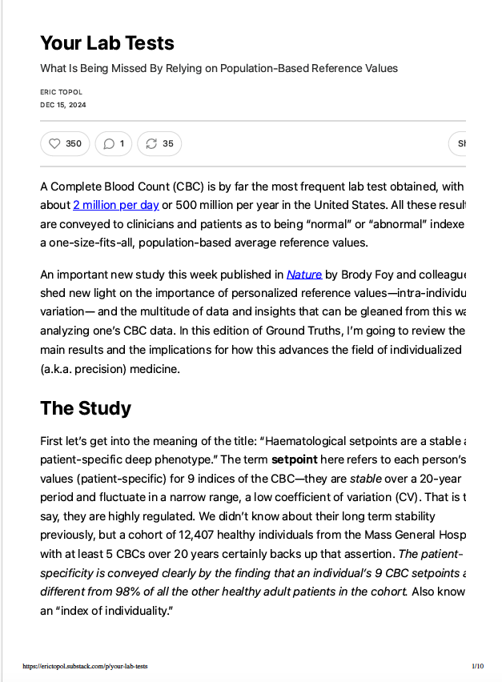
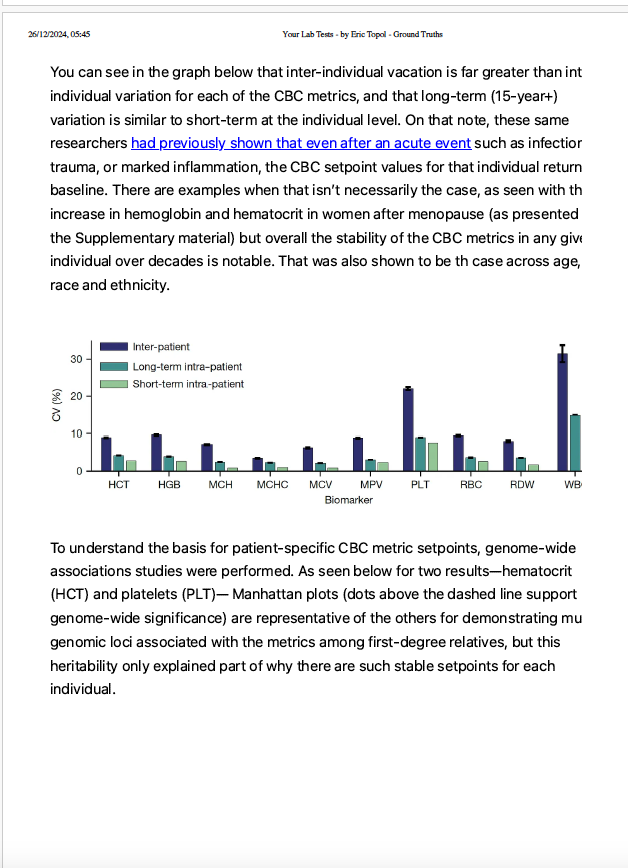
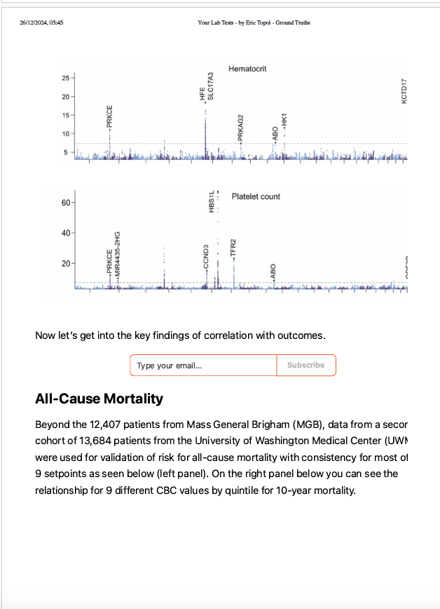
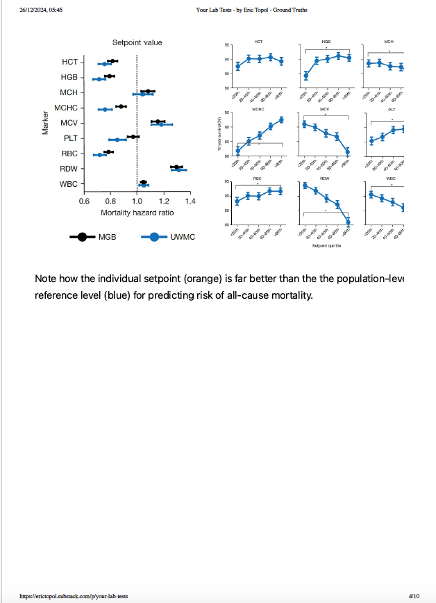
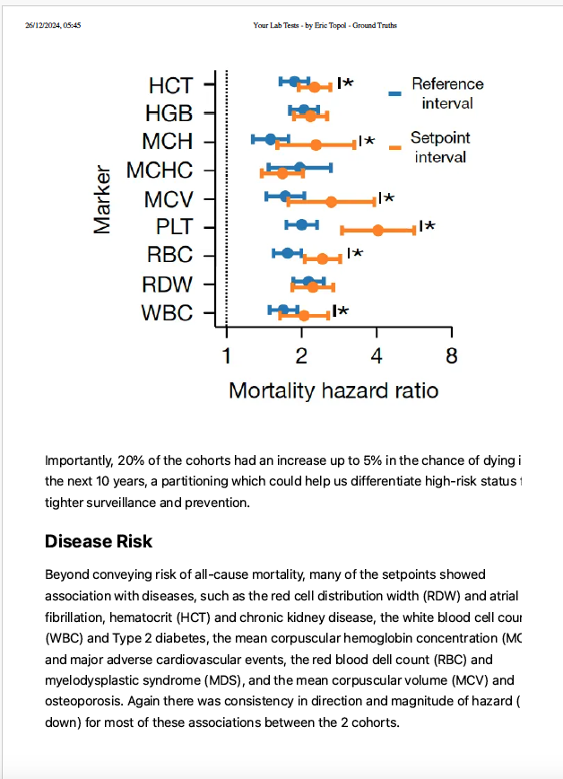
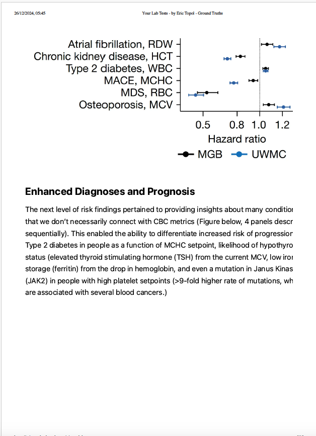
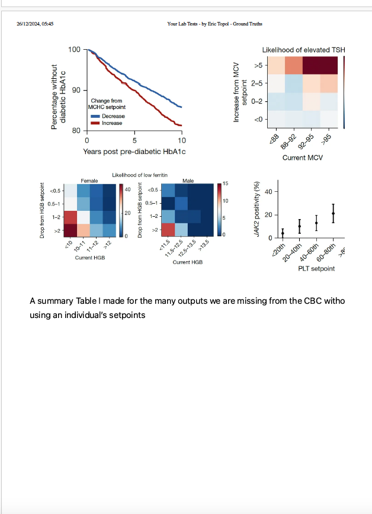
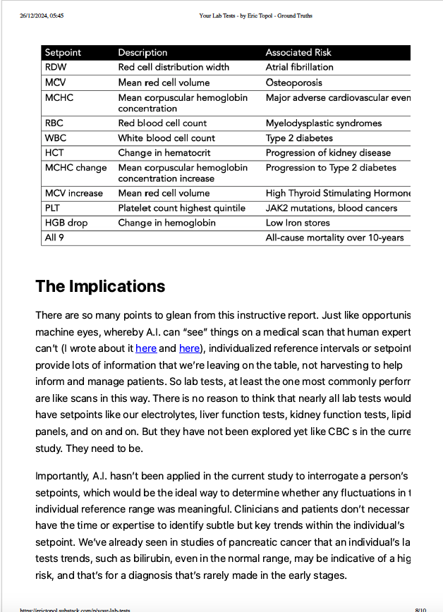
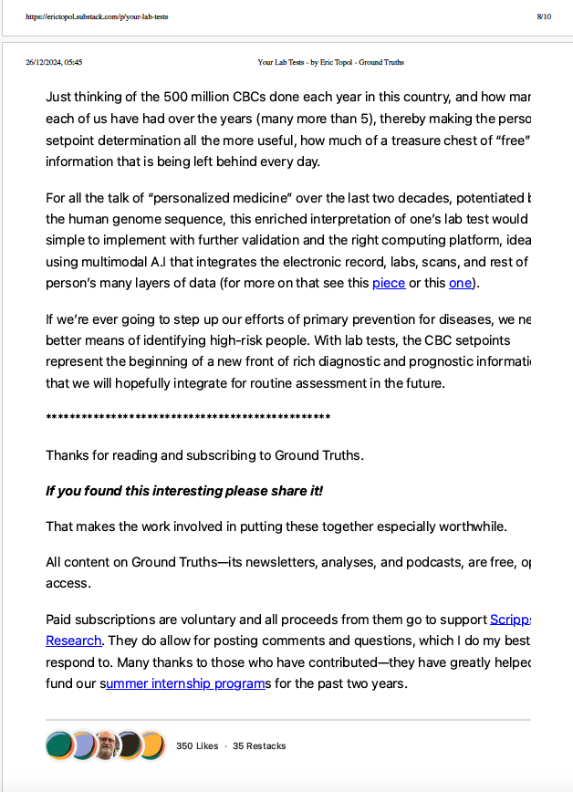

# README.md

[Your Lab Tests article - Eric Topol](https://erictopol.substack.com/p/your-lab-tests)

This program will calculate personalised reference ranges for FBC values by averaging my last n (3) test results, will increment n++ as more blood tests are done in future to expand data set.

## relevant article screenshots

